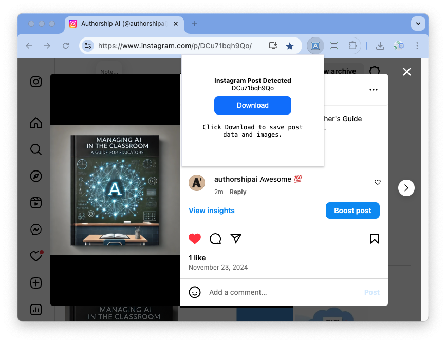
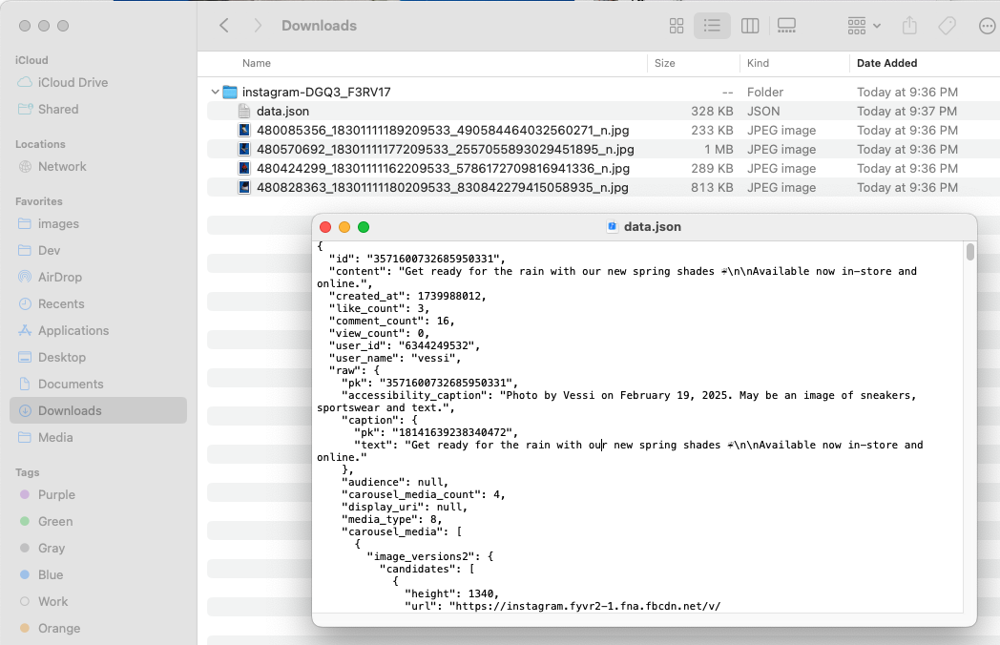

# Appents Social Media Post Downloader

Download captions, view / like counts, images, and videos (non-streamed) from Instagram and X / Twitter posts.

🚀💡✅ &nbsp;&nbsp;We encourage submitting pull requests to add additional platforms / functionality.

This project is brought to you by [Appents](https://appents.com). Get in touch for your social media content analysis needs. We specialize in content analysis and enabling data-driven brand management.

  
  

## Instructions

1. Navigate to a single Instragram / X post.
2. Click the Download button in this Chrome Extension.
3. Files and extracted data are downloaded to Downloads.

## Unique features

- based on regular HTML content already fetched by browser
- downloaded data.json contains post id, user name, captions, and view / comment / like counts in JSON format

```
// fields returned in data.json on download
// "raw" is additional data for debugging
export type TargetFields = {
  id: string;
  content: string;
  created_at: string;
  like_count: number;
  comment_count: number;
  view_count: number;
  user_id: string;
  user_name: string;
  raw?: JsonObject | null;
  errors?: string[] | null;
};
```

## Known Limitations

- One post at a time (no feed scraping)
- Only works in Chrome browser
- Can not save a post's video if streamed

# Chrome Extension Starter Kit

This project was started using [Chrome Extension Starter Kit](https://github.com/chibat/chrome-extension-typescript-starter).

The remainder of this readme file is from that project.

## Prerequisites

- [node + npm](https://nodejs.org/) (Current Version)

## Option

- [Visual Studio Code](https://code.visualstudio.com/)

## Includes the following

- TypeScript
- Webpack
- React
- Jest

## Project Structure

- src/typescript: TypeScript source files
- src/assets: static files
- dist: Chrome Extension directory
- dist/js: Generated JavaScript files

## Setup

```
npm install
```

## Import as Visual Studio Code project

...

## Build

```
npm run build
```

## Build in watch mode

### terminal

```
npm run watch
```

### Visual Studio Code

Run watch mode.

type `Ctrl + Shift + B`

## Load extension to chrome

Load `dist` directory

## Test

`npx jest` or `npm run test`
